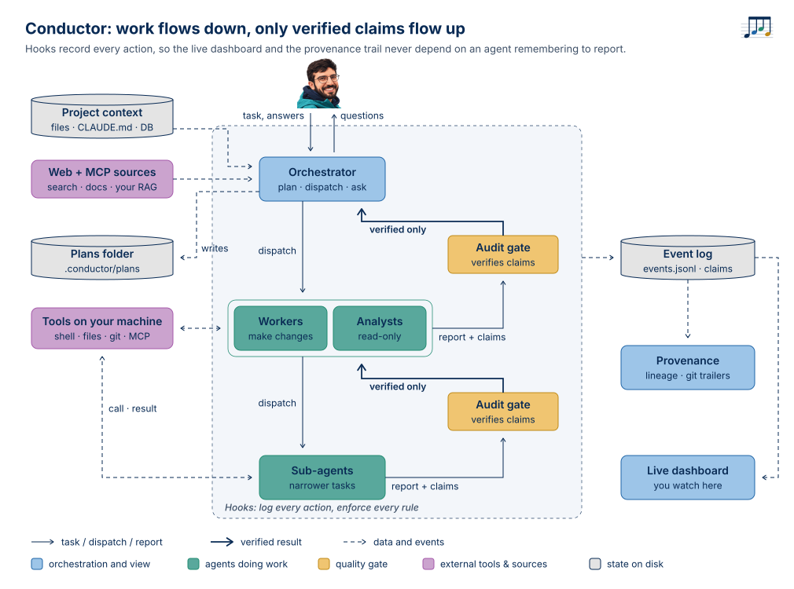
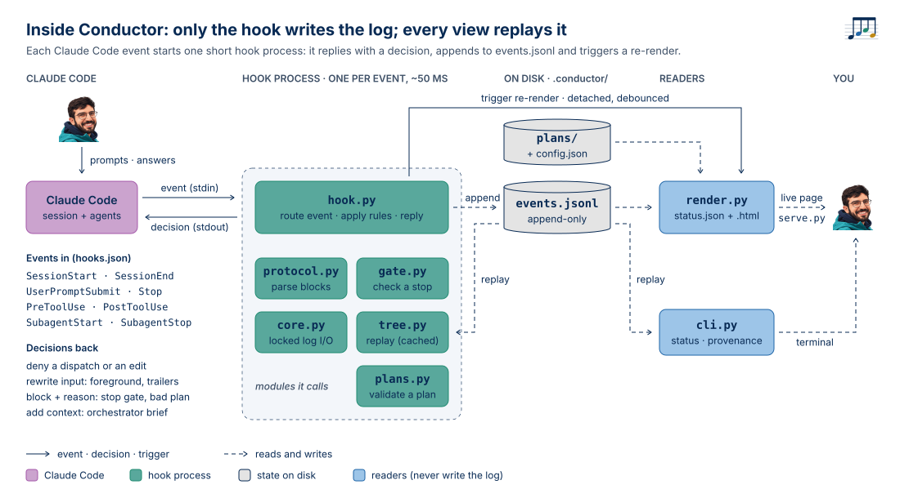

<p align="center"></p>

# Conductor

**A multi-agent orchestration harness for Claude Code.** Work flows down, only verified claims flow up, and hooks record everything.



Conductor turns a Claude Code session into an orchestrator that plans, dispatches agents (which can dispatch their own), and reports back to you. Every result passes an independent audit gate first. You can watch all of it on a live dashboard and trace any claim back to the files and commands it came from.

What makes it different from a prompt that says "please plan, delegate and double-check": **the rules are enforced by Claude Code hooks, not requested from the model.**

| If an agent tries to… | Conductor… |
|---|---|
| dispatch work without a task id and acceptance criteria | refuses the dispatch and shows the envelope format |
| report "done" while its sub-agents are still running | blocks the report until they finish |
| report "done" without its claims being independently checked | blocks it and tells it to call an auditor |
| cite a file it never read or a command it never ran | blocks it: *"C1 cites cmd:pytest but you never ran it"* |
| keep a claim the auditor refuted, or reword one after review | blocks it until it's fixed and re-reviewed, or withdrawn |
| (as auditor) mark claims verified without checking anything | blocks the verdict |
| (as orchestrator) edit project files itself | refuses: the orchestrator plans, workers make the changes |

After 3 failed attempts the agent is let through, but its output is marked **unverified** and lands in your review queue. Nothing unverified reaches you unlabelled.

## Features

- **Orchestrator.** It plans in `.conductor/plans/`, dispatches agents (in parallel when the tasks are independent), asks you when a decision is yours, and synthesises results citing claim ids (`T2/C1`).
- **Nested agents.** Workers delegate to sub-workers. Every agent gets a parent, a task and a depth, recovered from hook payloads rather than self-reported.
- **Audit gate.** A separate auditor agent with a fresh context re-checks each claim against its source before the worker may report upward.
- **Provenance built in.** One append-only event log covers every dispatch, file read (with content hash), command, write, claim, verdict and human answer. `conductor provenance T1/C2` prints the full lineage. Agent-made commits get `Conductor-Run/Task/Agent/Plan` git trailers.
- **Live dashboard.** It's regenerated on every event, so it's live by construction rather than when an agent remembers to update it. It shows the current state, plan and tasks, the agent tree, claims, items waiting on you, and a log.
- **Status at any time.** `/conductor:status` (or `conductor status` in any terminal) shows who is doing what right now. It costs no tokens and interrupts nothing.
- **Zero dependencies.** Stdlib Python 3.9+, about 50 ms per hook, flat as the log grows (the hook keeps an incremental cache of the replayed state).

## Install

Requires Claude Code (tested on 2.1.285), `python3` ≥ 3.9 and `git`. Runs on macOS and Linux.

```bash
claude plugin marketplace add reza-phys/conductor
```

```bash
claude plugin install conductor@conductor
```

Or try it without installing:

```bash
claude --plugin-dir /path/to/conductor
```

Then, in your project:

```
/conductor:init      # creates .conductor/ (config, standards, plans/)
/conductor:serve     # live dashboard on http://127.0.0.1:8765
```

Conductor only activates in projects that contain `.conductor/`. Everywhere else the hooks exit silently.

For the terminal commands (`conductor status`, `conductor provenance …`, `conductor serve`), alias the CLI:

```bash
alias conductor='python3 /path/to/conductor/src/conductor/cli.py'
```

## Use

**Soft mode (default).** Work in a normal Claude Code session. At session start a hook injects a short orchestrator brief, so the session plans and delegates on its own:

> Audit src/calc.py: check every function for correctness and tell me what is wrong.

**Strict mode.** The main session runs as the `conductor` agent, with exactly the orchestrator tool set (no shell, writes only under `.conductor/`):

```bash
claude --agent conductor:conductor
```

While it runs:

```
/conductor:status               # agent tree, what each agent is doing now, items needing you
/conductor:provenance T1/C2     # lineage of a claim; also accepts a task id, agent id or file path
```

```
orchestrator
└─ ✓ analyst·ad9064 [T1] Audit calc.py for correctness 2m48s · gate passed ×1
   ├─ ✓ auditor·ab8d8a [review:T1] Review calc.py audit claims 49s · gate passed
   └─ ✓ auditor·acb570 [review:T1] Re-review updated calc.py claims 68s · gate passed ×1
```

## How it works

```
you ──task──▶ orchestrator ──<conductor-task id=T1 criteria=…>──▶ worker ──▶ sub-worker
                  ▲                                                 │
                  └──── verified claims only ◀── audit gate ◀───┘
hooks ─▶ .conductor/events.jsonl ─▶ status.json ─▶ status.html (live)
```

1. **Envelope.** Every dispatch starts with `<conductor-task id="T3" plan="P1@v1">criteria: …</conductor-task>`. A `PreToolUse` hook refuses dispatches without one and enforces a depth budget, so every worker can still reach an auditor.
2. **Linkage.** Hooks see `agent_id` on every event inside a subagent. A `PostToolUse(Agent)` event carries both the parent's and the child's id, so the tree is reconstructed from facts.
3. **Claims.** A worker ends with a report block listing claims, each with evidence (`file:src/x.py:10-30`, `cmd:pytest -q`, `url:…`, `mcp:labdb__query`, `claim:T2.1/C1`).
4. **Review.** The worker sends its claims to `conductor:auditor` in a `<conductor-review for="T3">` envelope. The auditor, which is read-only and starts with a fresh context, returns a verdict per claim: `verified`, `refuted` or `unverified`.
5. **Gate.** A `SubagentStop` hook decides whether the worker may finish:
   - sub-agents have finished, and the report is well formed;
   - the cited evidence appears in the agent's own observations;
   - every claim has an independent verdict, nothing refuted is still claimed, and nothing was reworded after review.

   Otherwise it returns `decision: block` with the exact reason.
6. **Render.** Every event triggers a debounced re-render of `status.json` and `status.html`, with no LLM in that loop.

How the harness works inside, from hook event to dashboard:



Design details: [docs/DESIGN.md](docs/DESIGN.md) · Provenance model: [docs/provenance.md](docs/provenance.md)

## Configuration

`.conductor/config.json` (all keys optional):

| Key | Default | Meaning |
|---|---|---|
| `dispatch.enforce_envelope` | `true` | refuse dispatches without a task envelope (built-in `Explore`/`Plan` are exempt) |
| `dispatch.max_depth` | `3` | mirror of `CLAUDE_CODE_MAX_SUBAGENT_SPAWN_DEPTH`; workers stop one level short, leaving room for an auditor |
| `dispatch.force_foreground_nested` | `true` | sub-agents wait for their own children |
| `dispatch.models` | `{}` | model per agent type, applied at dispatch, e.g. `{"conductor:auditor": "haiku"}` |
| `orchestrator.allow_project_edits` | `false` | let the main session edit project files |
| `orchestrator.inject_protocol` | `true` | soft-mode brief at session start |
| `gate.require_claims` / `check_evidence` / `require_verdicts` | `true` | the three gate checks |
| `gate.max_blocks` | `3` | then let the agent through, marked unverified |
| `gate.allow_review_skip` | `true` | honour `review="skip"` on a task envelope for low-stakes work; its claims show as *asserted*, not verified |
| `provenance.commit_trailers` | `true` | stamp agent commits |

`.conductor/standards.md` holds your global quality bar, which every auditor reads.

## Examples

Real runs, committed with their full event logs:

- [`examples/calc-review`](examples/calc-review): a three-task plan with parallel workers and a nested sub-worker.
- [`examples/audit-review`](examples/audit-review): soft mode, plain request. The gate blocked agents three times for real problems before the answer arrived.
- [`examples/strict-fix`](examples/strict-fix): strict mode. The bug was fixed, the tests run and committed, and the worker's attempt to cite its reviewer's verdict as evidence was blocked.

## Limitations

- **The auditor is a model.** It can still be wrong. The gate guarantees a check happened, against sources the agents actually touched. It does not guarantee the check was right. Pinning the auditor to a different model helps.
- **Evidence matching is syntactic.** "You ran `pytest`" is checked against the commands actually run, not whether that command proves the claim. That judgement is the auditor's job.
- **Built on Claude Code internals.** It relies on hook payload fields (`agent_id`, `background_tasks`, `last_assistant_message`) and on one undocumented file (`subagents/*.meta.json`, with a FIFO fallback). The tests pin recorded payloads; a Claude Code update may need a patch.
- **Questions to you go through the orchestrator.** Only the main session can ask you questions, so a blocked sub-agent waits until the orchestrator asks and resumes it.
- No Windows support yet: the hooks call `python3` and use `fcntl`.

## Development

```bash
python3 -m unittest discover -s tests -v
```

```bash
python3 dashboard/preview.py
```

The second command renders `dashboard/sample-status.json` into `dashboard/preview.html` and runs the page self-check.

## License

MIT
